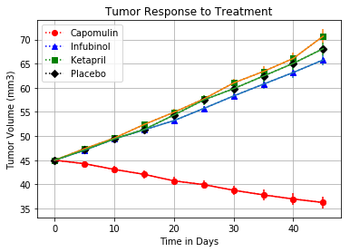
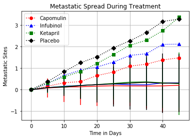
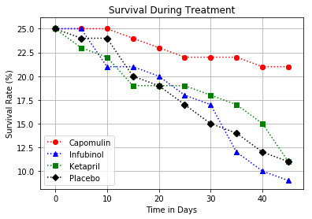
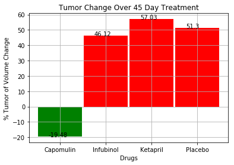

```python
# Dependencies and Setup
%matplotlib inline
import matplotlib.pyplot as plt
import pandas as pd
import numpy as np

# Hide warning messages in notebook
import warnings
warnings.filterwarnings('ignore')

# File to Load (Remember to Change These)
mouse_data = "Data/mouse_drug_data.csv"
clinical_data = "Data/clinicaltrial_data.csv"

# Read the Mouse and Drug Data and the Clinical Trial Data

mousedata_df = pd.read_csv(mouse_data)
mousedata_df.head()
#mousedata_df

```


<div>
<style scoped>
    .dataframe tbody tr th:only-of-type {
        vertical-align: middle;
    }

    .dataframe tbody tr th {
        vertical-align: top;
    }

    .dataframe thead th {
        text-align: right;
    }
</style>
<table border="1" class="dataframe">
  <thead>
    <tr style="text-align: right;">
      <th></th>
      <th>Mouse ID</th>
      <th>Drug</th>
    </tr>
  </thead>
  <tbody>
    <tr>
      <th>0</th>
      <td>f234</td>
      <td>Stelasyn</td>
    </tr>
    <tr>
      <th>1</th>
      <td>x402</td>
      <td>Stelasyn</td>
    </tr>
    <tr>
      <th>2</th>
      <td>a492</td>
      <td>Stelasyn</td>
    </tr>
    <tr>
      <th>3</th>
      <td>w540</td>
      <td>Stelasyn</td>
    </tr>
    <tr>
      <th>4</th>
      <td>v764</td>
      <td>Stelasyn</td>
    </tr>
  </tbody>
</table>
</div>


```python
cd_df = pd.read_csv(clinical_data)
cd_df.head()
```


<div>
<style scoped>
    .dataframe tbody tr th:only-of-type {
        vertical-align: middle;
    }

    .dataframe tbody tr th {
        vertical-align: top;
    }

    .dataframe thead th {
        text-align: right;
    }
</style>
<table border="1" class="dataframe">
  <thead>
    <tr style="text-align: right;">
      <th></th>
      <th>Mouse ID</th>
      <th>Timepoint</th>
      <th>Tumor Volume (mm3)</th>
      <th>Metastatic Sites</th>
    </tr>
  </thead>
  <tbody>
    <tr>
      <th>0</th>
      <td>b128</td>
      <td>0</td>
      <td>45.0</td>
      <td>0</td>
    </tr>
    <tr>
      <th>1</th>
      <td>f932</td>
      <td>0</td>
      <td>45.0</td>
      <td>0</td>
    </tr>
    <tr>
      <th>2</th>
      <td>g107</td>
      <td>0</td>
      <td>45.0</td>
      <td>0</td>
    </tr>
    <tr>
      <th>3</th>
      <td>a457</td>
      <td>0</td>
      <td>45.0</td>
      <td>0</td>
    </tr>
    <tr>
      <th>4</th>
      <td>c819</td>
      <td>0</td>
      <td>45.0</td>
      <td>0</td>
    </tr>
  </tbody>
</table>
</div>


```python
# Combine the data into a single dataset

#result = pd.concat([mousedata_df, cd_df], axis=1, join='inner')
result = cd_df.merge(mousedata_df, on="Mouse ID", how = 'inner')


# Display the data table for preview

result.head()
```


<div>
<style scoped>
    .dataframe tbody tr th:only-of-type {
        vertical-align: middle;
    }

    .dataframe tbody tr th {
        vertical-align: top;
    }

    .dataframe thead th {
        text-align: right;
    }
</style>
<table border="1" class="dataframe">
  <thead>
    <tr style="text-align: right;">
      <th></th>
      <th>Mouse ID</th>
      <th>Timepoint</th>
      <th>Tumor Volume (mm3)</th>
      <th>Metastatic Sites</th>
      <th>Drug</th>
    </tr>
  </thead>
  <tbody>
    <tr>
      <th>0</th>
      <td>b128</td>
      <td>0</td>
      <td>45.000000</td>
      <td>0</td>
      <td>Capomulin</td>
    </tr>
    <tr>
      <th>1</th>
      <td>b128</td>
      <td>5</td>
      <td>45.651331</td>
      <td>0</td>
      <td>Capomulin</td>
    </tr>
    <tr>
      <th>2</th>
      <td>b128</td>
      <td>10</td>
      <td>43.270852</td>
      <td>0</td>
      <td>Capomulin</td>
    </tr>
    <tr>
      <th>3</th>
      <td>b128</td>
      <td>15</td>
      <td>43.784893</td>
      <td>0</td>
      <td>Capomulin</td>
    </tr>
    <tr>
      <th>4</th>
      <td>b128</td>
      <td>20</td>
      <td>42.731552</td>
      <td>0</td>
      <td>Capomulin</td>
    </tr>
  </tbody>
</table>
</div>


## Tumor Response to Treatment


```python
# Store the Mean Tumor Volume Data Grouped by Drug and Timepoint 

result_tpd = result.groupby(['Drug', 'Timepoint'])['Tumor Volume (mm3)'].mean()
result_tpd

# Convert to DataFrame

tpd_df = pd.DataFrame(result_tpd) 

# # Preview DataFrame
# tvrange = tpd_df['Tumor Volume (mm3)'].tolist()
# tvrange

tpd_df.head()
#Means of Tutor
#val_tpd = tpd_df.values
#val_tpd
```


<div>
<style scoped>
    .dataframe tbody tr th:only-of-type {
        vertical-align: middle;
    }

    .dataframe tbody tr th {
        vertical-align: top;
    }

    .dataframe thead th {
        text-align: right;
    }
</style>
<table border="1" class="dataframe">
  <thead>
    <tr style="text-align: right;">
      <th></th>
      <th></th>
      <th>Tumor Volume (mm3)</th>
    </tr>
    <tr>
      <th>Drug</th>
      <th>Timepoint</th>
      <th></th>
    </tr>
  </thead>
  <tbody>
    <tr>
      <th rowspan="5" valign="top">Capomulin</th>
      <th>0</th>
      <td>45.000000</td>
    </tr>
    <tr>
      <th>5</th>
      <td>44.266086</td>
    </tr>
    <tr>
      <th>10</th>
      <td>43.084291</td>
    </tr>
    <tr>
      <th>15</th>
      <td>42.064317</td>
    </tr>
    <tr>
      <th>20</th>
      <td>40.716325</td>
    </tr>
  </tbody>
</table>
</div>


```python

```


```python
# Store the Standard Error of Tumor Volumes Grouped by Drug and Timepoint

tpd_df_sem = result.groupby(['Drug', 'Timepoint'])['Tumor Volume (mm3)'].sem()
tpd_df_sem
# Convert to DataFrame

sem_df = pd.DataFrame(tpd_df_sem) 

# # Preview DataFrame

# Preview DataFrame


sem_df_ = pd.pivot_table(sem_df, 
                          index=['Timepoint'], 
                          columns=['Drug']) 

# Preview that Reformatting worked
#sem_df_


semlist = sem_df_.loc[ : , 'Tumor Volume (mm3)']
#semlist

Capomulin_sem = semlist[["Capomulin"]]
Capomulin_list_sem = Capomulin_sem ['Capomulin'].tolist()

Infubinol_sem = semlist[["Infubinol"]]
Infubinol_list_sem = Infubinol_sem['Infubinol'].tolist()

Ketapril_sem = semlist[["Ketapril"]]
Ketapril_list_sem = Ketapril_sem['Ketapril'].tolist()

Placebo_sem = semlist[["Placebo"]]
Placebo_list_sem = Placebo_sem['Placebo'].tolist()

#Placebo_list_sem
```


```python
# Minor Data Munging to Re-Format the Data Frames
tpd_mung = pd.pivot_table(result, 
                          index=['Timepoint'], 
                          columns=['Drug']) 
#tpd_mung
# Preview that Reformatting worked
xx = tpd_mung.loc[ : , 'Tumor Volume (mm3)']
xx
```


<div>
<style scoped>
    .dataframe tbody tr th:only-of-type {
        vertical-align: middle;
    }

    .dataframe tbody tr th {
        vertical-align: top;
    }

    .dataframe thead th {
        text-align: right;
    }
</style>
<table border="1" class="dataframe">
  <thead>
    <tr style="text-align: right;">
      <th>Drug</th>
      <th>Capomulin</th>
      <th>Ceftamin</th>
      <th>Infubinol</th>
      <th>Ketapril</th>
      <th>Naftisol</th>
      <th>Placebo</th>
      <th>Propriva</th>
      <th>Ramicane</th>
      <th>Stelasyn</th>
      <th>Zoniferol</th>
    </tr>
    <tr>
      <th>Timepoint</th>
      <th></th>
      <th></th>
      <th></th>
      <th></th>
      <th></th>
      <th></th>
      <th></th>
      <th></th>
      <th></th>
      <th></th>
    </tr>
  </thead>
  <tbody>
    <tr>
      <th>0</th>
      <td>45.000000</td>
      <td>45.000000</td>
      <td>45.000000</td>
      <td>45.000000</td>
      <td>45.000000</td>
      <td>45.000000</td>
      <td>45.000000</td>
      <td>45.000000</td>
      <td>45.000000</td>
      <td>45.000000</td>
    </tr>
    <tr>
      <th>5</th>
      <td>44.266086</td>
      <td>46.503051</td>
      <td>47.062001</td>
      <td>47.389175</td>
      <td>46.796098</td>
      <td>47.125589</td>
      <td>47.248967</td>
      <td>43.944859</td>
      <td>47.527452</td>
      <td>46.851818</td>
    </tr>
    <tr>
      <th>10</th>
      <td>43.084291</td>
      <td>48.285125</td>
      <td>49.403909</td>
      <td>49.582269</td>
      <td>48.694210</td>
      <td>49.423329</td>
      <td>49.101541</td>
      <td>42.531957</td>
      <td>49.463844</td>
      <td>48.689881</td>
    </tr>
    <tr>
      <th>15</th>
      <td>42.064317</td>
      <td>50.094055</td>
      <td>51.296397</td>
      <td>52.399974</td>
      <td>50.933018</td>
      <td>51.359742</td>
      <td>51.067318</td>
      <td>41.495061</td>
      <td>51.529409</td>
      <td>50.779059</td>
    </tr>
    <tr>
      <th>20</th>
      <td>40.716325</td>
      <td>52.157049</td>
      <td>53.197691</td>
      <td>54.920935</td>
      <td>53.644087</td>
      <td>54.364417</td>
      <td>53.346737</td>
      <td>40.238325</td>
      <td>54.067395</td>
      <td>53.170334</td>
    </tr>
    <tr>
      <th>25</th>
      <td>39.939528</td>
      <td>54.287674</td>
      <td>55.715252</td>
      <td>57.678982</td>
      <td>56.731968</td>
      <td>57.482574</td>
      <td>55.504138</td>
      <td>38.974300</td>
      <td>56.166123</td>
      <td>55.432935</td>
    </tr>
    <tr>
      <th>30</th>
      <td>38.769339</td>
      <td>56.769517</td>
      <td>58.299397</td>
      <td>60.994507</td>
      <td>59.559509</td>
      <td>59.809063</td>
      <td>58.196374</td>
      <td>38.703137</td>
      <td>59.826738</td>
      <td>57.713531</td>
    </tr>
    <tr>
      <th>35</th>
      <td>37.816839</td>
      <td>58.827548</td>
      <td>60.742461</td>
      <td>63.371686</td>
      <td>62.685087</td>
      <td>62.420615</td>
      <td>60.350199</td>
      <td>37.451996</td>
      <td>62.440699</td>
      <td>60.089372</td>
    </tr>
    <tr>
      <th>40</th>
      <td>36.958001</td>
      <td>61.467895</td>
      <td>63.162824</td>
      <td>66.068580</td>
      <td>65.600754</td>
      <td>65.052675</td>
      <td>63.045537</td>
      <td>36.574081</td>
      <td>65.356386</td>
      <td>62.916692</td>
    </tr>
    <tr>
      <th>45</th>
      <td>36.236114</td>
      <td>64.132421</td>
      <td>65.755562</td>
      <td>70.662958</td>
      <td>69.265506</td>
      <td>68.084082</td>
      <td>66.258529</td>
      <td>34.955595</td>
      <td>68.438310</td>
      <td>65.960888</td>
    </tr>
  </tbody>
</table>
</div>


```python
Capomulin = xx[["Capomulin"]]
Capomulin_list = Capomulin['Capomulin'].tolist()

Infubinol = xx[["Infubinol"]]
Infubinol_list = Infubinol['Infubinol'].tolist()

Ketapril = xx[["Ketapril"]]
Ketapril_list = Ketapril['Ketapril'].tolist()

Placebo = xx[["Placebo"]]
Placebo_list = Placebo['Placebo'].tolist()

# dictionary = dict(zip(Capomulin_list, Capomulin_list_sem))
# dictionary
```


```python
# Generate the Plot (with Error Bars)

# The maximum x value for our chart will be 100
x_limit = 50

# List of values from 0 to 100 each value being 1 greater than the last
x_axis = np.arange(0, x_limit, 5)

# Create a random array of data that we will use for our y values
plt.scatter(x_axis, Capomulin_list, marker='o', color='red')
plt.plot(x_axis, Capomulin_list, 'r:o', label='Capomulin')
plt.errorbar(x_axis, Capomulin_list, yerr=Capomulin_list_sem, color='red')

plt.scatter(x_axis, Infubinol_list, marker='^', color='blue')
plt.plot(x_axis, Infubinol_list, 'b:^', label='Infubinol')
plt.errorbar(x_axis, Infubinol_list, yerr=Infubinol_list_sem)

plt.scatter(x_axis, Ketapril_list, marker='s', color='green')
plt.plot(x_axis, Ketapril_list, 'g:s', label='Ketapril')
plt.errorbar(x_axis, Ketapril_list, yerr=Ketapril_list_sem)

plt.scatter(x_axis, Placebo_list, marker='D', color='black')
plt.plot(x_axis, Placebo_list, 'k:D', label='Placebo')
plt.errorbar(x_axis, Placebo_list, yerr=Placebo_list_sem)

plt.xlabel('Time in Days')
plt.ylabel('Tumor Volume (mm3)')
plt.title('Tumor Response to Treatment')

# Save the Figure
plt.savefig('Images/Tumor Response to Treatment.jpg')

# Show the Figure
plt.grid()
plt.legend()
plt.show()

```





## Metastatic Response to Treatment


```python
# Store the Mean Met. Site Data Grouped by Drug and Timepoint 

metamean = result.groupby(['Drug', 'Timepoint'])['Metastatic Sites'].mean()
metamean


```


    Drug       Timepoint
    Capomulin  0            0.000000
               5            0.160000
               10           0.320000
               15           0.375000
               20           0.652174
               25           0.818182
               30           1.090909
               35           1.181818
               40           1.380952
               45           1.476190
    Ceftamin   0            0.000000
               5            0.380952
               10           0.600000
               15           0.789474
               20           1.111111
               25           1.500000
               30           1.937500
               35           2.071429
               40           2.357143
               45           2.692308
    Infubinol  0            0.000000
               5            0.280000
               10           0.666667
               15           0.904762
               20           1.050000
               25           1.277778
               30           1.588235
               35           1.666667
               40           2.100000
               45           2.111111
                              ...   
    Ramicane   0            0.000000
               5            0.120000
               10           0.250000
               15           0.333333
               20           0.347826
               25           0.652174
               30           0.782609
               35           0.952381
               40           1.100000
               45           1.250000
    Stelasyn   0            0.000000
               5            0.240000
               10           0.478261
               15           0.782609
               20           0.952381
               25           1.157895
               30           1.388889
               35           1.562500
               40           1.583333
               45           1.727273
    Zoniferol  0            0.000000
               5            0.166667
               10           0.500000
               15           0.809524
               20           1.294118
               25           1.687500
               30           1.933333
               35           2.285714
               40           2.785714
               45           3.071429
    Name: Metastatic Sites, Length: 100, dtype: float64


```python
# Convert to DataFrame

meta_df = pd.DataFrame(metamean) 
meta_df
# Preview DataFrame
```


<div>
<style scoped>
    .dataframe tbody tr th:only-of-type {
        vertical-align: middle;
    }

    .dataframe tbody tr th {
        vertical-align: top;
    }

    .dataframe thead th {
        text-align: right;
    }
</style>
<table border="1" class="dataframe">
  <thead>
    <tr style="text-align: right;">
      <th></th>
      <th></th>
      <th>Metastatic Sites</th>
    </tr>
    <tr>
      <th>Drug</th>
      <th>Timepoint</th>
      <th></th>
    </tr>
  </thead>
  <tbody>
    <tr>
      <th rowspan="10" valign="top">Capomulin</th>
      <th>0</th>
      <td>0.000000</td>
    </tr>
    <tr>
      <th>5</th>
      <td>0.160000</td>
    </tr>
    <tr>
      <th>10</th>
      <td>0.320000</td>
    </tr>
    <tr>
      <th>15</th>
      <td>0.375000</td>
    </tr>
    <tr>
      <th>20</th>
      <td>0.652174</td>
    </tr>
    <tr>
      <th>25</th>
      <td>0.818182</td>
    </tr>
    <tr>
      <th>30</th>
      <td>1.090909</td>
    </tr>
    <tr>
      <th>35</th>
      <td>1.181818</td>
    </tr>
    <tr>
      <th>40</th>
      <td>1.380952</td>
    </tr>
    <tr>
      <th>45</th>
      <td>1.476190</td>
    </tr>
    <tr>
      <th rowspan="10" valign="top">Ceftamin</th>
      <th>0</th>
      <td>0.000000</td>
    </tr>
    <tr>
      <th>5</th>
      <td>0.380952</td>
    </tr>
    <tr>
      <th>10</th>
      <td>0.600000</td>
    </tr>
    <tr>
      <th>15</th>
      <td>0.789474</td>
    </tr>
    <tr>
      <th>20</th>
      <td>1.111111</td>
    </tr>
    <tr>
      <th>25</th>
      <td>1.500000</td>
    </tr>
    <tr>
      <th>30</th>
      <td>1.937500</td>
    </tr>
    <tr>
      <th>35</th>
      <td>2.071429</td>
    </tr>
    <tr>
      <th>40</th>
      <td>2.357143</td>
    </tr>
    <tr>
      <th>45</th>
      <td>2.692308</td>
    </tr>
    <tr>
      <th rowspan="10" valign="top">Infubinol</th>
      <th>0</th>
      <td>0.000000</td>
    </tr>
    <tr>
      <th>5</th>
      <td>0.280000</td>
    </tr>
    <tr>
      <th>10</th>
      <td>0.666667</td>
    </tr>
    <tr>
      <th>15</th>
      <td>0.904762</td>
    </tr>
    <tr>
      <th>20</th>
      <td>1.050000</td>
    </tr>
    <tr>
      <th>25</th>
      <td>1.277778</td>
    </tr>
    <tr>
      <th>30</th>
      <td>1.588235</td>
    </tr>
    <tr>
      <th>35</th>
      <td>1.666667</td>
    </tr>
    <tr>
      <th>40</th>
      <td>2.100000</td>
    </tr>
    <tr>
      <th>45</th>
      <td>2.111111</td>
    </tr>
    <tr>
      <th>...</th>
      <th>...</th>
      <td>...</td>
    </tr>
    <tr>
      <th rowspan="10" valign="top">Ramicane</th>
      <th>0</th>
      <td>0.000000</td>
    </tr>
    <tr>
      <th>5</th>
      <td>0.120000</td>
    </tr>
    <tr>
      <th>10</th>
      <td>0.250000</td>
    </tr>
    <tr>
      <th>15</th>
      <td>0.333333</td>
    </tr>
    <tr>
      <th>20</th>
      <td>0.347826</td>
    </tr>
    <tr>
      <th>25</th>
      <td>0.652174</td>
    </tr>
    <tr>
      <th>30</th>
      <td>0.782609</td>
    </tr>
    <tr>
      <th>35</th>
      <td>0.952381</td>
    </tr>
    <tr>
      <th>40</th>
      <td>1.100000</td>
    </tr>
    <tr>
      <th>45</th>
      <td>1.250000</td>
    </tr>
    <tr>
      <th rowspan="10" valign="top">Stelasyn</th>
      <th>0</th>
      <td>0.000000</td>
    </tr>
    <tr>
      <th>5</th>
      <td>0.240000</td>
    </tr>
    <tr>
      <th>10</th>
      <td>0.478261</td>
    </tr>
    <tr>
      <th>15</th>
      <td>0.782609</td>
    </tr>
    <tr>
      <th>20</th>
      <td>0.952381</td>
    </tr>
    <tr>
      <th>25</th>
      <td>1.157895</td>
    </tr>
    <tr>
      <th>30</th>
      <td>1.388889</td>
    </tr>
    <tr>
      <th>35</th>
      <td>1.562500</td>
    </tr>
    <tr>
      <th>40</th>
      <td>1.583333</td>
    </tr>
    <tr>
      <th>45</th>
      <td>1.727273</td>
    </tr>
    <tr>
      <th rowspan="10" valign="top">Zoniferol</th>
      <th>0</th>
      <td>0.000000</td>
    </tr>
    <tr>
      <th>5</th>
      <td>0.166667</td>
    </tr>
    <tr>
      <th>10</th>
      <td>0.500000</td>
    </tr>
    <tr>
      <th>15</th>
      <td>0.809524</td>
    </tr>
    <tr>
      <th>20</th>
      <td>1.294118</td>
    </tr>
    <tr>
      <th>25</th>
      <td>1.687500</td>
    </tr>
    <tr>
      <th>30</th>
      <td>1.933333</td>
    </tr>
    <tr>
      <th>35</th>
      <td>2.285714</td>
    </tr>
    <tr>
      <th>40</th>
      <td>2.785714</td>
    </tr>
    <tr>
      <th>45</th>
      <td>3.071429</td>
    </tr>
  </tbody>
</table>
<p>100 rows × 1 columns</p>
</div>


```python
# Store the Standard Error associated with Met. Sites Grouped by Drug and Timepoint 

meta_sem = result.groupby(['Drug', 'Timepoint'])['Metastatic Sites'].sem()
meta_sem
# Convert to DataFrame

meta_semd = pd.DataFrame(meta_sem) 

# Preview DataFrame


meta_semdf = pd.pivot_table(meta_semd, 
                          index=['Timepoint'], 
                          columns=['Drug']) 
meta_semdfp = meta_semdf.loc[ : , 'Metastatic Sites']
#meta_semdfp

```


```python
##To list Sems

# Capomulin_msem = meta_semdfp[["Capomulin"]]
# Capomulin_list_msem = Capomulin_msem ['Capomulin'].tolist()
# Capomulin_list_msem
# Infubinol_msem = meta_semdfp[["Infubinol"]]
# Infubinol_list_msem = Infubinol_msem['Infubinol'].tolist()

# Ketapril_msem = meta_semdfp[["Ketapril"]]
# Ketapril_list_msem = Ketapril_msem['Ketapril'].tolist()

Placebo_msem = meta_semdfp[["Placebo"]]
Placebo_list_msem = Placebo_msem['Placebo'].tolist()

Placebo_list_msem
```


```python
# Minor Data Munging to Re-Format the Data Frames

meta_mung = pd.pivot_table(result, 
                          index=['Timepoint'], 
                          columns=['Drug']) 

# Preview that Reformatting worked
mungsites = tpd_mung.loc[ : , 'Metastatic Sites']
mungsites
```


<div>
<style scoped>
    .dataframe tbody tr th:only-of-type {
        vertical-align: middle;
    }

    .dataframe tbody tr th {
        vertical-align: top;
    }

    .dataframe thead th {
        text-align: right;
    }
</style>
<table border="1" class="dataframe">
  <thead>
    <tr style="text-align: right;">
      <th>Drug</th>
      <th>Capomulin</th>
      <th>Ceftamin</th>
      <th>Infubinol</th>
      <th>Ketapril</th>
      <th>Naftisol</th>
      <th>Placebo</th>
      <th>Propriva</th>
      <th>Ramicane</th>
      <th>Stelasyn</th>
      <th>Zoniferol</th>
    </tr>
    <tr>
      <th>Timepoint</th>
      <th></th>
      <th></th>
      <th></th>
      <th></th>
      <th></th>
      <th></th>
      <th></th>
      <th></th>
      <th></th>
      <th></th>
    </tr>
  </thead>
  <tbody>
    <tr>
      <th>0</th>
      <td>0.000000</td>
      <td>0.000000</td>
      <td>0.000000</td>
      <td>0.000000</td>
      <td>0.000000</td>
      <td>0.000000</td>
      <td>0.000000</td>
      <td>0.000000</td>
      <td>0.000000</td>
      <td>0.000000</td>
    </tr>
    <tr>
      <th>5</th>
      <td>0.160000</td>
      <td>0.380952</td>
      <td>0.280000</td>
      <td>0.304348</td>
      <td>0.260870</td>
      <td>0.375000</td>
      <td>0.320000</td>
      <td>0.120000</td>
      <td>0.240000</td>
      <td>0.166667</td>
    </tr>
    <tr>
      <th>10</th>
      <td>0.320000</td>
      <td>0.600000</td>
      <td>0.666667</td>
      <td>0.590909</td>
      <td>0.523810</td>
      <td>0.833333</td>
      <td>0.565217</td>
      <td>0.250000</td>
      <td>0.478261</td>
      <td>0.500000</td>
    </tr>
    <tr>
      <th>15</th>
      <td>0.375000</td>
      <td>0.789474</td>
      <td>0.904762</td>
      <td>0.842105</td>
      <td>0.857143</td>
      <td>1.250000</td>
      <td>0.764706</td>
      <td>0.333333</td>
      <td>0.782609</td>
      <td>0.809524</td>
    </tr>
    <tr>
      <th>20</th>
      <td>0.652174</td>
      <td>1.111111</td>
      <td>1.050000</td>
      <td>1.210526</td>
      <td>1.150000</td>
      <td>1.526316</td>
      <td>1.000000</td>
      <td>0.347826</td>
      <td>0.952381</td>
      <td>1.294118</td>
    </tr>
    <tr>
      <th>25</th>
      <td>0.818182</td>
      <td>1.500000</td>
      <td>1.277778</td>
      <td>1.631579</td>
      <td>1.500000</td>
      <td>1.941176</td>
      <td>1.357143</td>
      <td>0.652174</td>
      <td>1.157895</td>
      <td>1.687500</td>
    </tr>
    <tr>
      <th>30</th>
      <td>1.090909</td>
      <td>1.937500</td>
      <td>1.588235</td>
      <td>2.055556</td>
      <td>2.066667</td>
      <td>2.266667</td>
      <td>1.615385</td>
      <td>0.782609</td>
      <td>1.388889</td>
      <td>1.933333</td>
    </tr>
    <tr>
      <th>35</th>
      <td>1.181818</td>
      <td>2.071429</td>
      <td>1.666667</td>
      <td>2.294118</td>
      <td>2.266667</td>
      <td>2.642857</td>
      <td>2.300000</td>
      <td>0.952381</td>
      <td>1.562500</td>
      <td>2.285714</td>
    </tr>
    <tr>
      <th>40</th>
      <td>1.380952</td>
      <td>2.357143</td>
      <td>2.100000</td>
      <td>2.733333</td>
      <td>2.466667</td>
      <td>3.166667</td>
      <td>2.777778</td>
      <td>1.100000</td>
      <td>1.583333</td>
      <td>2.785714</td>
    </tr>
    <tr>
      <th>45</th>
      <td>1.476190</td>
      <td>2.692308</td>
      <td>2.111111</td>
      <td>3.363636</td>
      <td>2.538462</td>
      <td>3.272727</td>
      <td>2.571429</td>
      <td>1.250000</td>
      <td>1.727273</td>
      <td>3.071429</td>
    </tr>
  </tbody>
</table>
</div>


```python
Capomulin_m = mungsites[["Capomulin"]]
Capomulin_list_m = Capomulin_m['Capomulin'].tolist()

Infubinol_m = mungsites[["Infubinol"]]
Infubinol_list_m = Infubinol_m['Infubinol'].tolist()

Ketapril_m = mungsites[["Ketapril"]]
Ketapril_list_m = Ketapril_m['Ketapril'].tolist()

Placebo_m = mungsites[["Placebo"]]
Placebo_list_m = Placebo_m['Placebo'].tolist()
#Placebo_list_m
```


```python
# Generate the Plot (with Error Bars)

x_limit = 50

# List of values from 0 to 100 each value being 1 greater than the last
x_axis = np.arange(0, x_limit, 5)

# Create a random array of data that we will use for our y values
plt.scatter(x_axis, Capomulin_list_m, marker='o', color='red')
plt.plot(x_axis, Capomulin_list_m, 'r:o', label='Capomulin')
plt.errorbar(x_axis, Capomulin_list_msem, yerr=Capomulin_list_sem, color='red')

plt.scatter(x_axis, Infubinol_list_m, marker='^', color='blue')
plt.plot(x_axis, Infubinol_list_m, 'b:^', label='Infubinol')
plt.errorbar(x_axis, Infubinol_list_msem, yerr=Infubinol_list_sem, color='blue')

plt.scatter(x_axis, Ketapril_list_m, marker='s', color='green')
plt.plot(x_axis, Ketapril_list_m, 'g:s', label='Ketapril')
plt.errorbar(x_axis, Ketapril_list_msem, yerr=Ketapril_list_sem, color='green')

plt.scatter(x_axis, Placebo_list_m, marker='D', color='black')
plt.plot(x_axis, Placebo_list_m, 'k:D', label='Placebo')
plt.errorbar(x_axis, Placebo_list_msem, yerr=Placebo_list_sem, color='black')

#for some reason I couldn't get the errorbars to print properly

plt.xlabel('Time in Days')
plt.ylabel('Metastatic Sites')
plt.title('Metastatic Spread During Treatment')

# Save the Figure
plt.savefig('Images/Metastatic Spread During Treatment.jpg')

# Show the Figure
plt.grid()
plt.legend()
plt.show()

```





## Survival Rates


```python
# Store the Count of Mice Grouped by Drug and Timepoint (W can pass any metric)

count = result.groupby(['Drug', 'Timepoint'])['Mouse ID'].count()
count

# Convert to DataFrame
mouse_df = pd.DataFrame(count)

# Preview DataFrame
mouse_df
```


<div>
<style scoped>
    .dataframe tbody tr th:only-of-type {
        vertical-align: middle;
    }

    .dataframe tbody tr th {
        vertical-align: top;
    }

    .dataframe thead th {
        text-align: right;
    }
</style>
<table border="1" class="dataframe">
  <thead>
    <tr style="text-align: right;">
      <th></th>
      <th></th>
      <th>Mouse ID</th>
    </tr>
    <tr>
      <th>Drug</th>
      <th>Timepoint</th>
      <th></th>
    </tr>
  </thead>
  <tbody>
    <tr>
      <th rowspan="10" valign="top">Capomulin</th>
      <th>0</th>
      <td>25</td>
    </tr>
    <tr>
      <th>5</th>
      <td>25</td>
    </tr>
    <tr>
      <th>10</th>
      <td>25</td>
    </tr>
    <tr>
      <th>15</th>
      <td>24</td>
    </tr>
    <tr>
      <th>20</th>
      <td>23</td>
    </tr>
    <tr>
      <th>25</th>
      <td>22</td>
    </tr>
    <tr>
      <th>30</th>
      <td>22</td>
    </tr>
    <tr>
      <th>35</th>
      <td>22</td>
    </tr>
    <tr>
      <th>40</th>
      <td>21</td>
    </tr>
    <tr>
      <th>45</th>
      <td>21</td>
    </tr>
    <tr>
      <th rowspan="10" valign="top">Ceftamin</th>
      <th>0</th>
      <td>25</td>
    </tr>
    <tr>
      <th>5</th>
      <td>21</td>
    </tr>
    <tr>
      <th>10</th>
      <td>20</td>
    </tr>
    <tr>
      <th>15</th>
      <td>19</td>
    </tr>
    <tr>
      <th>20</th>
      <td>18</td>
    </tr>
    <tr>
      <th>25</th>
      <td>18</td>
    </tr>
    <tr>
      <th>30</th>
      <td>16</td>
    </tr>
    <tr>
      <th>35</th>
      <td>14</td>
    </tr>
    <tr>
      <th>40</th>
      <td>14</td>
    </tr>
    <tr>
      <th>45</th>
      <td>13</td>
    </tr>
    <tr>
      <th rowspan="10" valign="top">Infubinol</th>
      <th>0</th>
      <td>25</td>
    </tr>
    <tr>
      <th>5</th>
      <td>25</td>
    </tr>
    <tr>
      <th>10</th>
      <td>21</td>
    </tr>
    <tr>
      <th>15</th>
      <td>21</td>
    </tr>
    <tr>
      <th>20</th>
      <td>20</td>
    </tr>
    <tr>
      <th>25</th>
      <td>18</td>
    </tr>
    <tr>
      <th>30</th>
      <td>17</td>
    </tr>
    <tr>
      <th>35</th>
      <td>12</td>
    </tr>
    <tr>
      <th>40</th>
      <td>10</td>
    </tr>
    <tr>
      <th>45</th>
      <td>9</td>
    </tr>
    <tr>
      <th>...</th>
      <th>...</th>
      <td>...</td>
    </tr>
    <tr>
      <th rowspan="10" valign="top">Ramicane</th>
      <th>0</th>
      <td>25</td>
    </tr>
    <tr>
      <th>5</th>
      <td>25</td>
    </tr>
    <tr>
      <th>10</th>
      <td>24</td>
    </tr>
    <tr>
      <th>15</th>
      <td>24</td>
    </tr>
    <tr>
      <th>20</th>
      <td>23</td>
    </tr>
    <tr>
      <th>25</th>
      <td>23</td>
    </tr>
    <tr>
      <th>30</th>
      <td>23</td>
    </tr>
    <tr>
      <th>35</th>
      <td>21</td>
    </tr>
    <tr>
      <th>40</th>
      <td>20</td>
    </tr>
    <tr>
      <th>45</th>
      <td>20</td>
    </tr>
    <tr>
      <th rowspan="10" valign="top">Stelasyn</th>
      <th>0</th>
      <td>26</td>
    </tr>
    <tr>
      <th>5</th>
      <td>25</td>
    </tr>
    <tr>
      <th>10</th>
      <td>23</td>
    </tr>
    <tr>
      <th>15</th>
      <td>23</td>
    </tr>
    <tr>
      <th>20</th>
      <td>21</td>
    </tr>
    <tr>
      <th>25</th>
      <td>19</td>
    </tr>
    <tr>
      <th>30</th>
      <td>18</td>
    </tr>
    <tr>
      <th>35</th>
      <td>16</td>
    </tr>
    <tr>
      <th>40</th>
      <td>12</td>
    </tr>
    <tr>
      <th>45</th>
      <td>11</td>
    </tr>
    <tr>
      <th rowspan="10" valign="top">Zoniferol</th>
      <th>0</th>
      <td>25</td>
    </tr>
    <tr>
      <th>5</th>
      <td>24</td>
    </tr>
    <tr>
      <th>10</th>
      <td>22</td>
    </tr>
    <tr>
      <th>15</th>
      <td>21</td>
    </tr>
    <tr>
      <th>20</th>
      <td>17</td>
    </tr>
    <tr>
      <th>25</th>
      <td>16</td>
    </tr>
    <tr>
      <th>30</th>
      <td>15</td>
    </tr>
    <tr>
      <th>35</th>
      <td>14</td>
    </tr>
    <tr>
      <th>40</th>
      <td>14</td>
    </tr>
    <tr>
      <th>45</th>
      <td>14</td>
    </tr>
  </tbody>
</table>
<p>100 rows × 1 columns</p>
</div>


```python
# Minor Data Munging to Re-Format the Data Frames
micemung = pd.pivot_table(mouse_df, index=["Timepoint"], columns=['Drug'])

# Preview the Data Frame
mice_mung = micemung.loc[ : , 'Mouse ID']
mice_mung


```


<div>
<style scoped>
    .dataframe tbody tr th:only-of-type {
        vertical-align: middle;
    }

    .dataframe tbody tr th {
        vertical-align: top;
    }

    .dataframe thead th {
        text-align: right;
    }
</style>
<table border="1" class="dataframe">
  <thead>
    <tr style="text-align: right;">
      <th>Drug</th>
      <th>Capomulin</th>
      <th>Ceftamin</th>
      <th>Infubinol</th>
      <th>Ketapril</th>
      <th>Naftisol</th>
      <th>Placebo</th>
      <th>Propriva</th>
      <th>Ramicane</th>
      <th>Stelasyn</th>
      <th>Zoniferol</th>
    </tr>
    <tr>
      <th>Timepoint</th>
      <th></th>
      <th></th>
      <th></th>
      <th></th>
      <th></th>
      <th></th>
      <th></th>
      <th></th>
      <th></th>
      <th></th>
    </tr>
  </thead>
  <tbody>
    <tr>
      <th>0</th>
      <td>25</td>
      <td>25</td>
      <td>25</td>
      <td>25</td>
      <td>25</td>
      <td>25</td>
      <td>26</td>
      <td>25</td>
      <td>26</td>
      <td>25</td>
    </tr>
    <tr>
      <th>5</th>
      <td>25</td>
      <td>21</td>
      <td>25</td>
      <td>23</td>
      <td>23</td>
      <td>24</td>
      <td>25</td>
      <td>25</td>
      <td>25</td>
      <td>24</td>
    </tr>
    <tr>
      <th>10</th>
      <td>25</td>
      <td>20</td>
      <td>21</td>
      <td>22</td>
      <td>21</td>
      <td>24</td>
      <td>23</td>
      <td>24</td>
      <td>23</td>
      <td>22</td>
    </tr>
    <tr>
      <th>15</th>
      <td>24</td>
      <td>19</td>
      <td>21</td>
      <td>19</td>
      <td>21</td>
      <td>20</td>
      <td>17</td>
      <td>24</td>
      <td>23</td>
      <td>21</td>
    </tr>
    <tr>
      <th>20</th>
      <td>23</td>
      <td>18</td>
      <td>20</td>
      <td>19</td>
      <td>20</td>
      <td>19</td>
      <td>17</td>
      <td>23</td>
      <td>21</td>
      <td>17</td>
    </tr>
    <tr>
      <th>25</th>
      <td>22</td>
      <td>18</td>
      <td>18</td>
      <td>19</td>
      <td>18</td>
      <td>17</td>
      <td>14</td>
      <td>23</td>
      <td>19</td>
      <td>16</td>
    </tr>
    <tr>
      <th>30</th>
      <td>22</td>
      <td>16</td>
      <td>17</td>
      <td>18</td>
      <td>15</td>
      <td>15</td>
      <td>13</td>
      <td>23</td>
      <td>18</td>
      <td>15</td>
    </tr>
    <tr>
      <th>35</th>
      <td>22</td>
      <td>14</td>
      <td>12</td>
      <td>17</td>
      <td>15</td>
      <td>14</td>
      <td>10</td>
      <td>21</td>
      <td>16</td>
      <td>14</td>
    </tr>
    <tr>
      <th>40</th>
      <td>21</td>
      <td>14</td>
      <td>10</td>
      <td>15</td>
      <td>15</td>
      <td>12</td>
      <td>9</td>
      <td>20</td>
      <td>12</td>
      <td>14</td>
    </tr>
    <tr>
      <th>45</th>
      <td>21</td>
      <td>13</td>
      <td>9</td>
      <td>11</td>
      <td>13</td>
      <td>11</td>
      <td>7</td>
      <td>20</td>
      <td>11</td>
      <td>14</td>
    </tr>
  </tbody>
</table>
</div>


```python
Capomulin_mm = mice_mung[["Capomulin"]]
Capomulin_list_mm = Capomulin_mm['Capomulin'].tolist()

Infubinol_mm = mice_mung[["Infubinol"]]
Infubinol_list_mm = Infubinol_mm['Infubinol'].tolist()

Ketapril_mm = mice_mung[["Ketapril"]]
Ketapril_list_mm = Ketapril_mm['Ketapril'].tolist()

Placebo_mm = mice_mung[["Placebo"]]
Placebo_list_mm = Placebo_mm['Placebo'].tolist()
Placebo_list_mm
```


    [25, 24, 24, 20, 19, 17, 15, 14, 12, 11]


```python
# Generate the Plot (Accounting for percentages)

x_limit = 50
x_axis = np.arange(0, x_limit, 5)

plt.scatter(x_axis, Capomulin_list_mm, marker='o', color='red')
plt.plot(x_axis, Capomulin_list_mm, 'r:o', label='Capomulin')


plt.scatter(x_axis, Infubinol_list_mm, marker='^', color='blue')
plt.plot(x_axis, Infubinol_list_mm, 'b:^', label='Infubinol')


plt.scatter(x_axis, Ketapril_list_mm, marker='s', color='green')
plt.plot(x_axis, Ketapril_list_mm, 'g:s', label='Ketapril')


plt.scatter(x_axis, Placebo_list_mm, marker='D', color='black')
plt.plot(x_axis, Placebo_list_mm, 'k:D', label='Placebo')


plt.title("Survival During Treatment")
plt.xlabel('Time in Days')
plt.ylabel('Survival Rate (%)')
plt.grid()
plt.legend()

# Save the Figure
plt.savefig('Images/Survival During Treatment.jpg')

# Show the Figure
plt.show()
```





## Summary Bar Graph


```python
# Calculate the percent changes for each drug
#drugs4pc = tpd_df.loc[['Capomulin', 'Infubinol', 'Ketapril', 'Placebo']]
newtpd = tpd_df.loc[ : , 'Tumor Volume (mm3)']
#newtpd
#print(newtpd[('Capomulin'), ('Timepoint')].iloc[-1])

pc_Capomulin = ((newtpd.loc['Capomulin'][45] - newtpd.loc['Capomulin'][0]) / newtpd.loc['Capomulin'][0]) * 100
pc_Capomulin = round(pc_Capomulin, 2)

pc_Ceftamin = ((newtpd.loc['Ceftamin'][45] - newtpd.loc['Ceftamin'][0]) / newtpd.loc['Ceftamin'][0]) * 100
pc_Ceftamin = round(pc_Ceftamin, 2)

pc_Infubinol = ((newtpd.loc['Infubinol'][45] - newtpd.loc['Infubinol'][0]) / newtpd.loc['Infubinol'][0]) * 100
pc_Infubinol = round(pc_Infubinol, 2)

pc_Ketapril = ((newtpd.loc['Ketapril'][45] - newtpd.loc['Ketapril'][0]) / newtpd.loc['Ketapril'][0]) * 100
pc_Ketapril = round(pc_Ketapril, 2)

pc_Naftisol = ((newtpd.loc['Naftisol'][45] - newtpd.loc['Naftisol'][0]) / newtpd.loc['Naftisol'][0]) * 100
pc_Naftisol = round(pc_Naftisol, 2)

pc_Placebo = ((newtpd.loc['Placebo'][45] - newtpd.loc['Placebo'][0]) / newtpd.loc['Placebo'][0]) * 100
pc_Placebo = round(pc_Placebo, 2)

pc_Propriva = ((newtpd.loc['Propriva'][45] - newtpd.loc['Propriva'][0]) / newtpd.loc['Propriva'][0]) * 100
pc_Propriva = round(pc_Propriva, 2)

pc_Ramicane = ((newtpd.loc['Ramicane'][45] - newtpd.loc['Ramicane'][0]) / newtpd.loc['Ramicane'][0]) * 100
pc_Ramicane = round(pc_Ramicane, 2)

pc_Stelasyn = ((newtpd.loc['Stelasyn'][45] - newtpd.loc['Stelasyn'][0]) / newtpd.loc['Stelasyn'][0]) * 100
pc_Stelasyn = round(pc_Stelasyn, 2)

pc_Zoniferol = ((newtpd.loc['Zoniferol'][45] - newtpd.loc['Zoniferol'][0]) / newtpd.loc['Zoniferol'][0]) * 100
pc_Zoniferol = round(pc_Zoniferol, 2)

l = [pc_Capomulin, pc_Ceftamin, 
                      pc_Infubinol, pc_Ketapril, 
                      pc_Naftisol, pc_Placebo, 
                      pc_Propriva, pc_Ramicane,
                     pc_Stelasyn, pc_Zoniferol]

percentchange_list = list(map("{}%".format, l))

Drugz = ['Capomulin', 'Ceftamin',
            'Infubinol',  'Ketapril',
            'Naftisol', 'Placebo',
            'Propriva', 'Ramicane',
            'Stelasyn', 'Zoniferol']

pcdf = pd.DataFrame(percentchange_list, columns = ['Percent Change',], index=Drugz)


# Display the data to confirm
pcdf
```


<div>
<style scoped>
    .dataframe tbody tr th:only-of-type {
        vertical-align: middle;
    }

    .dataframe tbody tr th {
        vertical-align: top;
    }

    .dataframe thead th {
        text-align: right;
    }
</style>
<table border="1" class="dataframe">
  <thead>
    <tr style="text-align: right;">
      <th></th>
      <th>Percent Change</th>
    </tr>
  </thead>
  <tbody>
    <tr>
      <th>Capomulin</th>
      <td>-19.48%</td>
    </tr>
    <tr>
      <th>Ceftamin</th>
      <td>42.52%</td>
    </tr>
    <tr>
      <th>Infubinol</th>
      <td>46.12%</td>
    </tr>
    <tr>
      <th>Ketapril</th>
      <td>57.03%</td>
    </tr>
    <tr>
      <th>Naftisol</th>
      <td>53.92%</td>
    </tr>
    <tr>
      <th>Placebo</th>
      <td>51.3%</td>
    </tr>
    <tr>
      <th>Propriva</th>
      <td>47.24%</td>
    </tr>
    <tr>
      <th>Ramicane</th>
      <td>-22.32%</td>
    </tr>
    <tr>
      <th>Stelasyn</th>
      <td>52.09%</td>
    </tr>
    <tr>
      <th>Zoniferol</th>
      <td>46.58%</td>
    </tr>
  </tbody>
</table>
</div>


```python
# Store all Relevant Percent Changes into a Tuple
toople = (pc_Capomulin, pc_Infubinol, pc_Ketapril, pc_Placebo)

# x = np.arange(-20, 60, 20)
bars = ['Capomulin', 'Infubinol', 'Ketapril', 'Placebo']


height = toople
y = np.arange(len(bars))
width = 1/1.05
plt.bar(y, height, width, color=['green', 'red', 'red', 'red'])
plt.grid()
plt.title("Tumor Change Over 45 Day Treatment")
plt.xlabel('Drugs')
plt.xticks(y, bars)
plt.ylabel('% Tumor of Volume Change')

for a,b in zip(y, height):
    plt.text(a - 0.25, b, str(b))


# Save the Figure
plt.savefig("Images/Tumor Change Over 45 Day Treatment.jpg")

# Show the Figure
fig.show()
```





## Three Observable Trends

* Capomulin performs the best out of the 4 samples because there is tumor reduction. 
* The Placebo drug is as ineffective as Infubinol and Ketapril 
* Of the selected sample size, Ketapril was the most unproductive Drug for Volume change
